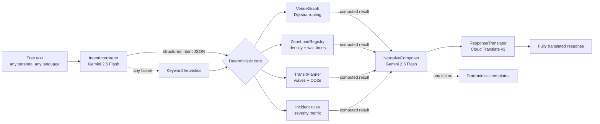

# PitchSide ⚽

**The match-day copilot for FIFA World Cup 2026 stadium operations.**


PitchSide is a GenAI-enabled operations platform serving **four personas** —
fans, volunteers, organizers and venue staff — during World Cup match days.
One free-text box (in any of seven languages) becomes step-free navigation,
live crowd intelligence, incident dispatch, and carbon-aware departure
planning, all backed by deterministic, auditable computation.

**Author:** Srinivas Reddy Yarragudi

---

## Challenge alignment

The challenge asks for a solution that improves stadium operations and the
tournament experience across specific verticals. PitchSide implements **all
eight**, each traceable to a concrete module and endpoint:

| Challenge vertical | PitchSide feature | Module | Endpoint |
|---|---|---|---|
| **Navigation** | Dijkstra routing over an explicit venue graph with per-segment distances and ETAs | `app/domain/venue_graph.py` | `POST /api/route`, `POST /api/assist` |
| **Crowd management** | Time-decayed zone density scoring from crowd reports; wait-time estimates from documented service rates | `app/domain/zone_load.py` | `POST /api/report`, `GET /api/zones` |
| **Accessibility** | Step-free routing as a first-class graph property (`step_free` edges: ramps/elevators vs stairs) plus a WCAG 2.1 AA interface | `app/domain/venue_graph.py`, `app/templates/` | `POST /api/route` with `accessibility_required` |
| **Transportation** | Staggered post-match departure waves per zone (deferred when congested) plus a Google Maps Routes API city leg for the onward journey | `app/domain/transit_planner.py`, `app/services/city_routes.py` | `POST /api/transit` |
| **Sustainability** | Per-mode CO₂e comparison with sourced IPCC/DEFRA emission factors; greenest option flagged on every plan | `app/domain/transit_planner.py` | `POST /api/transit` |
| **Multilingual assistance** | Full-response translation — every string in the JSON response — across en/es/fr/pt/ar/de/hi via Cloud Translate v3 | `app/services/translator.py` | all endpoints (`language` field) |
| **Operational intelligence** | Organizer dashboard: zone heatmap, incidents by severity, recommended congestion actions; snapshots archived to Cloud Storage | `app/services/assistant.py` | `GET /api/ops/summary` |
| **Real-time decision support** | Incident triage matrix (P1/P2/P3) combining category, danger keywords and Cloud NL sentiment into an immediate dispatch action | `app/domain/incident_rules.py` | `POST /api/report` |

---

## The doctrine: Gemini interprets, the graph computes

Generative AI is powerful at understanding messy human input and terrible at
being an auditable source of numbers. PitchSide therefore splits every request
into two stages:



* **Gemini never calculates.** Distances, ETAs, densities, wait times,
  severity scores and emissions all come from `app/domain/` — pure Python
  with documented constants and known-answer tests.
* **Every generative call has a deterministic fallback.** If Vertex AI is
  unreachable (or returns garbage), keyword heuristics parse the intent and
  templates phrase the answer. The platform keeps working with **zero Google
  credentials** — proven by the resilience test suite.

## Google services

| Service | Module | Purpose |
|---|---|---|
| **Vertex AI (Gemini 2.5 Flash)** | `app/services/gateway.py` | Intent parsing and narrative composition; initialised via both `vertexai.init()` and `aiplatform.init()` |
| **Cloud Translate v3** | `app/services/translator.py` | Recursive full-response translation across 7 languages |
| **Firestore** | `app/services/ledger.py` | Durable crowd-report and incident ledger (`EventLedger` Protocol, in-memory mirror) |
| **Cloud Natural Language** | `app/services/sentiment.py` | Sentiment signal feeding the incident severity matrix |
| **Secret Manager** | `app/services/secrets.py` | Secret resolution with environment fallback |
| **Cloud Storage** | `app/services/archive.py` | Daily operations-snapshot archive |
| **Google Maps Platform (Routes API)** | `app/services/city_routes.py` | City-side transit legs (stadium → city centre) with deterministic fallback |
| **Cloud Run** | `Dockerfile` | Serverless deployment (asia-south1), non-root multi-stage image |

## Sourced constants

Deterministic outputs cite their inputs:

* **Emission factors** (gCO₂e per passenger-km): metro 30 and bus 80 from
  IPCC AR5 WGIII Ch. 8 (Transport) — <https://www.ipcc.ch/report/ar5/wg3/>;
  car 171 from UK DEFRA/BEIS 2023 conversion factors —
  <https://www.gov.uk/government/publications/greenhouse-gas-reporting-conversion-factors-2023>.
* **Walking speeds**: 1.2 m/s standard, 0.9 m/s assisted — transport
  engineering design values (TRB Highway Capacity Manual range).
* **Queue service rates**: security 8 / concession 3 / restroom 10 people
  per minute per lane — planning-order figures consistent with published
  event-safety queueing guidance.
* **Density decay half-life**: 600 s, matching the cadence of stadium crowd
  phase changes.

## API

All POST bodies accept an optional `"language"` (`en`, `es`, `fr`, `pt`,
`ar`, `de`, `hi`).

| Method | Path | Purpose |
|---|---|---|
| POST | `/api/assist` | Conversational entry point (message + persona) |
| POST | `/api/route` | Deterministic routing; `accessibility_required` for step-free only |
| POST | `/api/report` | Crowd (`kind: crowd`) or incident (`kind: incident`) report |
| GET | `/api/zones` | Live zone density heat list |
| POST | `/api/transit` | Departure wave + carbon comparison |
| GET | `/api/ops/summary` | Organizer dashboard summary |
| GET | `/api/health` | Per-service availability (always 200) |

### Example — Spanish, accessible routing

```bash
curl -s -X POST "$BASE/api/assist" -H "Content-Type: application/json" -d '{
  "message": "Wheelchair route from Gate B to Section 201",
  "persona": "fan",
  "language": "es"
}'
```

Every human-readable string in the response — guidance, origin, destination,
statuses — returns in Spanish; zone ids, modes and severity codes stay
machine-stable.

### Example — Hindi crowd report

```bash
curl -s -X POST "$BASE/api/report" -H "Content-Type: application/json" -d '{
  "kind": "crowd", "zone": "north", "level": "high", "language": "hi"
}'
```

## Running locally

```bash
python -m venv .venv && source .venv/bin/activate
pip install -r requirements.txt
export GOOGLE_CLOUD_PROJECT=<your-project>   # optional: degrades gracefully without it
python main.py                                # http://localhost:8080
```

Quality gates:

```bash
pip install -r requirements-dev.txt
python -m pytest -q --cov=app     # 193 tests, 99% coverage
python -m pylint app/ tests/      # 10.00
python -m radon cc app/ -n C      # empty: no C-grade complexity
python -m mypy app/               # no issues in 24 source files
```

## Deploying to Cloud Run

```bash
gcloud run deploy pitchside --source=. --region=asia-south1 \
  --allow-unauthenticated --memory=512Mi --timeout=120 \
  --set-env-vars=GOOGLE_CLOUD_PROJECT=<your-project>
```

See also [`SECURITY.md`](SECURITY.md) for the full security policy.

## Security

* Security headers (CSP, HSTS, X-Frame-Options, X-Content-Type-Options,
  Referrer-Policy, Permissions-Policy) applied in a single `after_request`
  hook; **no** `before_request` origin filtering that could block clients.
* Strict input validation at the API boundary: type checks, length caps,
  language and persona whitelists.
* Generous in-memory rate limiting (240 req/min per client) with a
  documented path to Redis/Memorystore for multi-instance deployments.
* No secrets in code; Secret Manager with environment fallback; non-root
  container user; `.env` gitignored.

## Architecture

See [`docs/ARCHITECTURE.md`](docs/ARCHITECTURE.md) for the module map, data
flow and design decisions (app factory, thin routes / fat services,
`EventLedger` Protocol, typed `UPSTREAM_FAILURES` degradation).

## Assumptions

1. The venue model ships with a representative World Cup stadium bowl
   (4 gates, concourse ring, upper level, transit links); real deployments
   would load venue graphs from configuration per stadium.
2. Crowd density is derived from participatory reports; integrating turnstile
   or CCTV counts would use the same `ZoneLoadRegistry` interface.
3. Emission factors are global planning averages; host-city grids (USA,
   Canada, Mexico) can be substituted per venue without code changes.
4. Wait-time estimates are planning-order, not commitments; the UI presents
   them as approximations ("~").
5. Without Google credentials the platform runs in full-fallback mode
   (heuristics + templates + in-memory ledger) — intentional, to keep the
   match-day experience alive through upstream outages.
